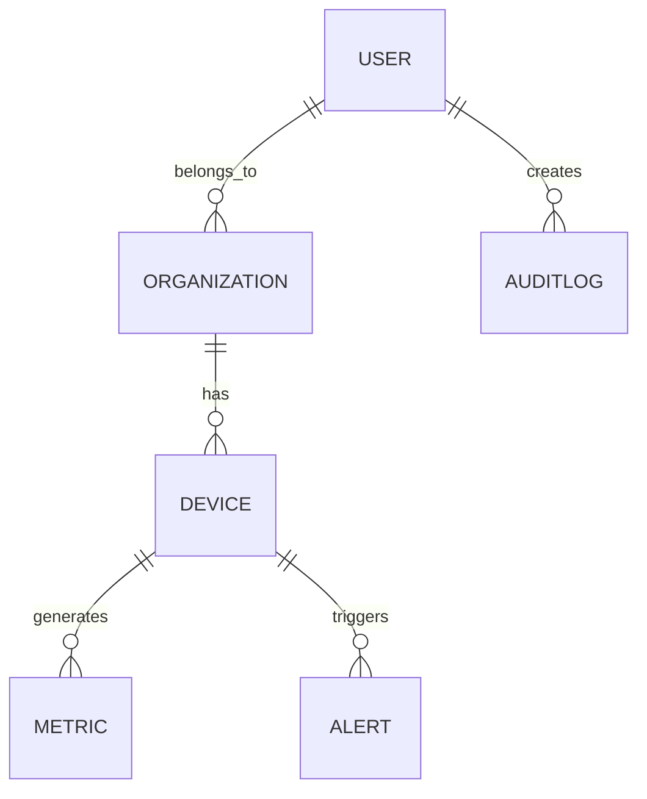

# Device Monitor API

Device Monitoring API-Based project built with [NestJS](https://nestjs.com),
[PostgreSQL](https://www.postgresql.org/), and [TypeORM](https://typeorm.io).

The project simulates a **real-world IoT monitoring platform** used by organizations to manage devices,
collect metrics, and generate alerts.  
It is designed as a showcase for **enterprise backend development** with NestJS.

---

## ✨ Features

- User & Organization management (multi-tenant)
- Device registration and lifecycle (active/inactive)
- Role-based access control (RBAC)
- Metrics ingestion & querying (time-series)
- Alerts & threshold monitoring
- Audit logging for compliance
- Observability (OpenTelemetry integration planned)
- Dockerized environment with PostgreSQL

---

## 🏗️ Architecture

**Entities:**

- User → belongs to Organization
- Organization → manages Users and Devices
- Device → belongs to Organization
- Metric → belongs to Device
- Alert → threshold-based events on Metrics
- AuditLog → logs user actions for compliance



---

## 🚀 Getting Started

### Prerequisites

- Node.js >= 18
- Docker & Docker Compose
- PostgreSQL (if running locally)

### Installation

```bash
git clone https://github.com/<your-username>/device-monitor-api.git
cd device-monitor-api
npm install
```

### Running with Docker

```bash
docker-compose up --build
```

API → http://localhost:3000  
PostgreSQL → localhost:5432 (db: devicedb / user: postgres / pass: postgres)

### Running in Development

```bash
npm run start:dev
```

---

## 🧪 Testing

```bash
npm run test
```

Tests are implemented with **Jest** (unit + integration planned).

---

## 📊 Development Roadmap

### Phase 1 – MVP: User, Organization, Device

- [x] Project setup with NestJS + PostgreSQL + TypeORM
- [ ] User CRUD + Authentication (JWT)
- [ ] Organization CRUD + Role-based Access Control
- [ ] Device CRUD within Organization
- [ ] Basic validation & exception handling
- [ ] Unit tests for core services

### Phase 2 – Metrics

- [ ] Metric ingestion API (POST device data)
- [ ] Time-series queries (filter by device + time range)
- [ ] Indexing & performance tuning for PostgreSQL
- [ ] Integration tests for metrics

### Phase 3 – Alerts & Observability

- [ ] Threshold-based alerts (temperature > X, etc.)
- [ ] Alert lifecycle (active → acknowledged → resolved)
- [ ] Audit logs (who changed what, when)
- [ ] OpenTelemetry tracing + Grafana dashboards
- [ ] CI/CD pipeline with GitHub Actions

---

## 📚 API Endpoints (Phase 1 – MVP)

### Auth

- `POST /auth/register` → Register new user
- `POST /auth/login` → Login + JWT token

### Users

- `GET /users` (admin only)
- `GET /users/:id`
- `PATCH /users/:id`
- `DELETE /users/:id`

### Organizations

- `POST /organizations` (admin only)
- `GET /organizations`
- `GET /organizations/:id`
- `PATCH /organizations/:id`
- `DELETE /organizations/:id`

### Devices

- `POST /devices`
- `GET /devices`
- `GET /devices/:id`
- `PATCH /devices/:id`
- `DELETE /devices/:id`

---

## 📜 License

This project is licensed under the MIT [License](./LICENSE).
